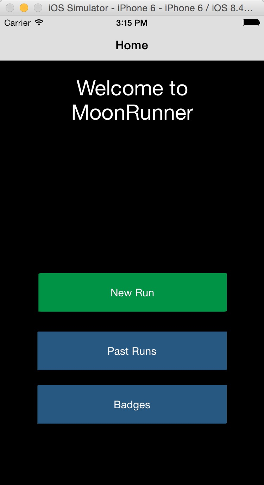
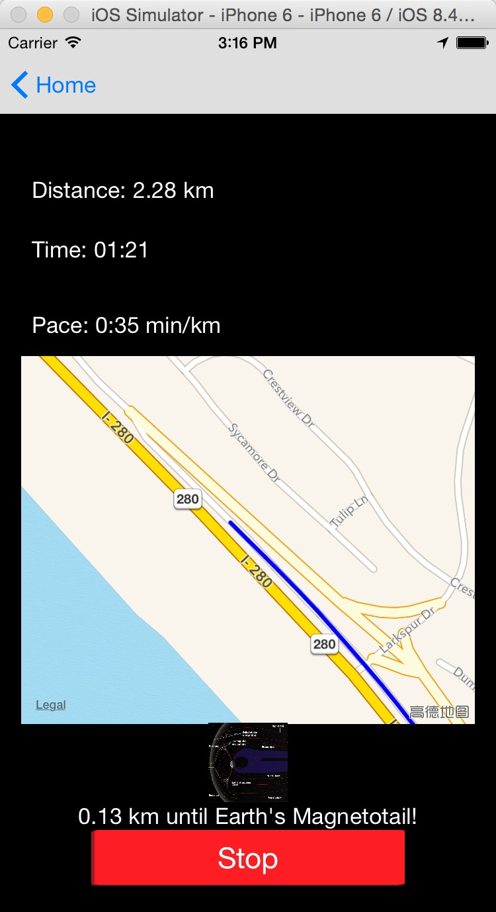
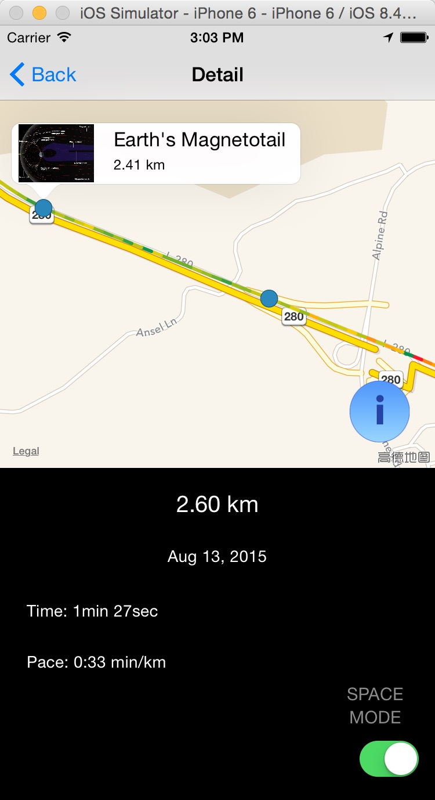
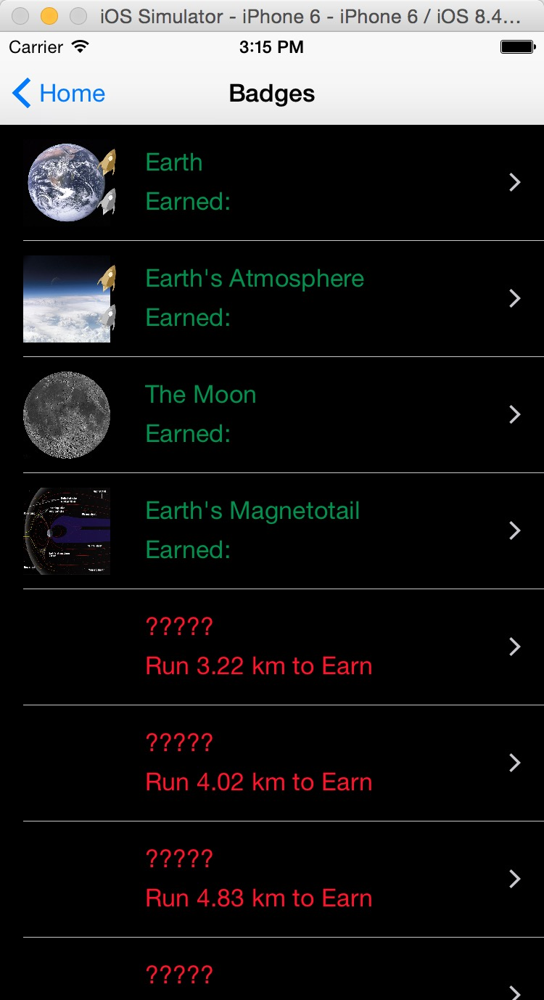
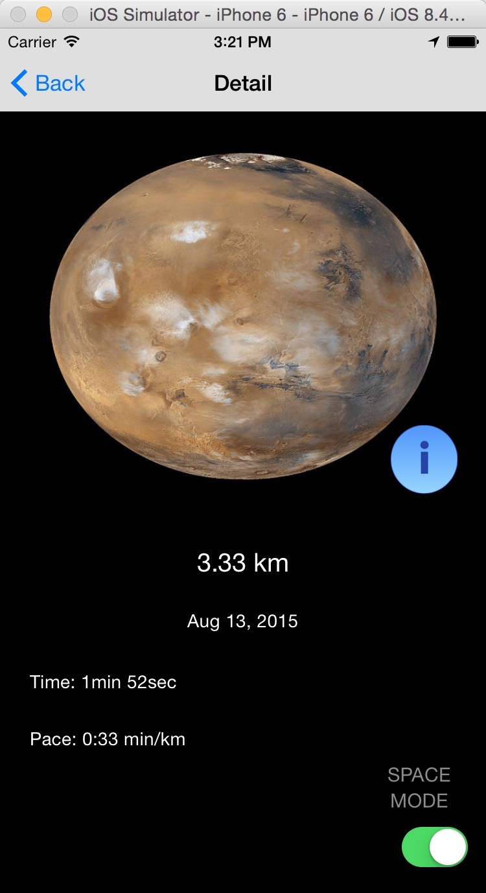

# MoonRunnerObjc
track gps in map, and encourage runner with 

## Where I learn? You can do it absolutely.
learn from raywenderlish, add auto layout by myself.  
step by step with the tutorial below.  
 1. [http://www.raywenderlich.com/73984/make-app-like-runkeeper-part-1](http://www.raywenderlich.com/73984/make-app-like-runkeeper-part-1)  
 2. [http://www.raywenderlich.com/74331/make-app-like-runkeeper-part-2](http://www.raywenderlich.com/74331/make-app-like-runkeeper-part-2)  

## The result pictures show.

   
 
   
 
 

## markdown中如何改变图片的显示尺寸?[learn from](http://www.lefern.com/question/653/markdownzhong-ru-he-gai-bian-tu-pian-de-xian-shi-chi-cun/)

* method 1  
&lt;img src="./images/MoonRunner-Badges-Detail.png" width = "375" height = "689" alt="图片名称" align=center /&gt;  
* method 2 （最后的右括号不知道如何写，哈哈）  
![图片名称](./images/MoonRunner-Badges-Detail.png =375x689
 
